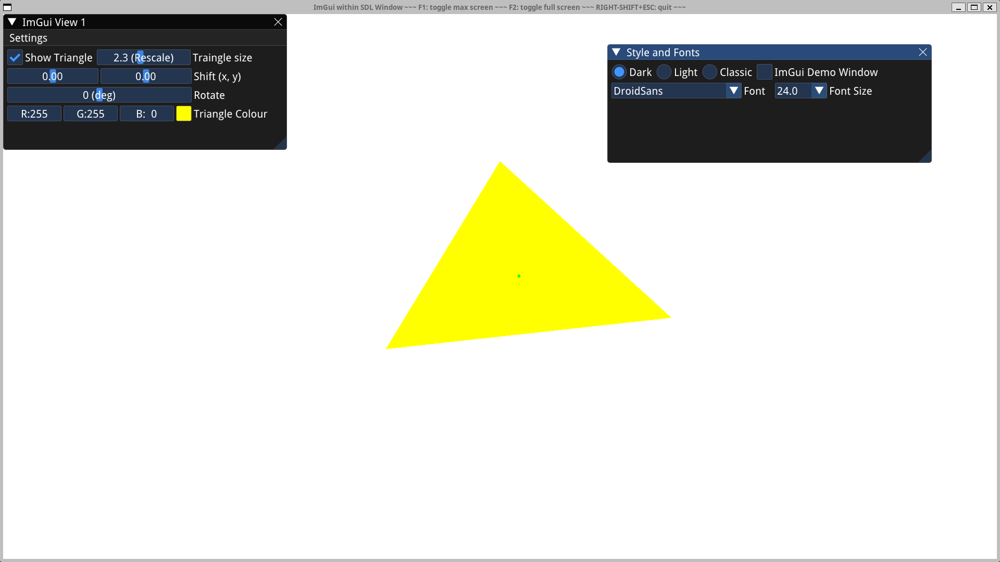
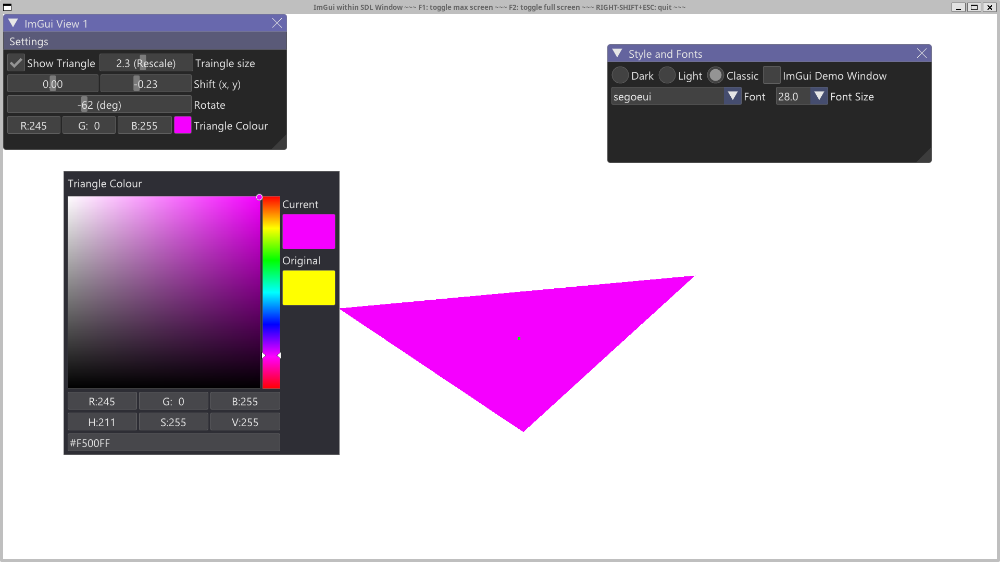
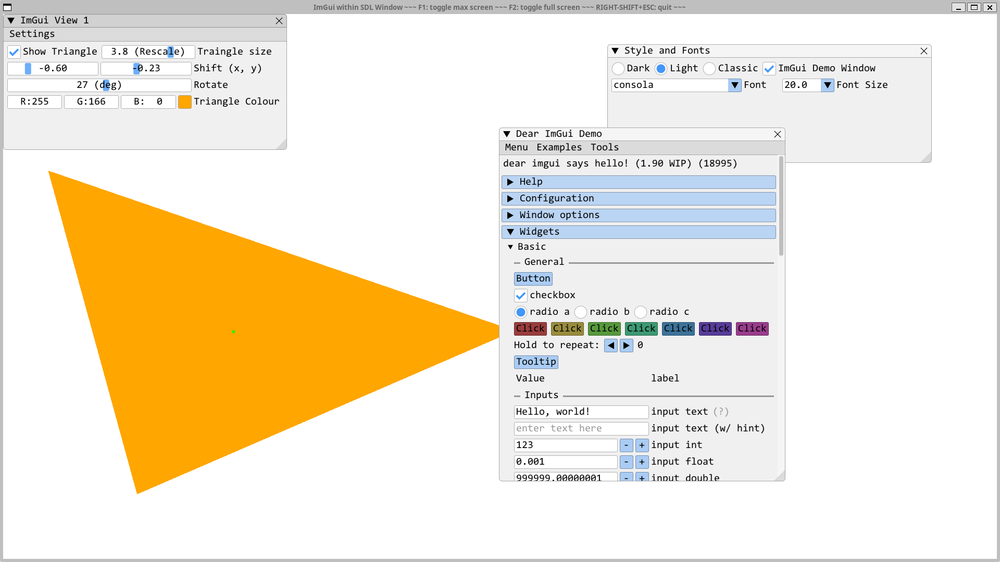

# Introduction to Dear ImGui: interactive OpenGL triangle with basic widgets and adjustible fontstyle/fontsize
SDL2 backend (configured with glad4.1) and Dear ImGui graphics; only C++ is needed to code this ... also modern style CMake with CMakePresets.json. This example is meant to serve as a starting point template for more elaborate C++ projects that could benefit from a nice GUI - without the hassle of incorporating other programing languages!




## CMake way (with CMakePresets.json) to build and run the program
```
git clone --depth 1 https://github.com/MariuszJozef/SDLImGuiTriangle.git
cd SDLImGuiTriangle
```

Ninja single-config generator with GNU compiler:
```
cmake --preset Ninja-Gnu-MinSizeRel
cmake --build --preset Ninja-Gnu-MinSizeRel
cmake --build --preset Ninja-Gnu-MinSizeRel --target run
```

or Clang compiler:
```
cmake --preset Ninja-Clang-MinSizeRel
cmake --build --preset Ninja-Clang-MinSizeRel
cmake --build --preset Ninja-Clang-MinSizeRel --target run
```

or Visual Studio compiler:
```
cmake --preset Ninja-Msvc-MinSizeRel
cmake --build --preset Ninja-Msvc-MinSizeRel
cmake --build --preset Ninja-Msvc-MinSizeRel --target run
```

**N.B.**

- On Windows 11 it is preferable to issue the commands from **"Developer Command Prompt for VS 2022"** instead of regular PowerShell or CMD because the former has predefined Visual Studio environment variables which enable compilation with VS compiler.
- If nevertheless using PowerShell/CMD, or on Windows 10, one must first run some appropriate *.bat scripts that define VS environment variables.

```
cmake --list-presets all
```
to see which other presets are available (out of those defined in CMakePresets.json) on a given platform.

## Some other possible way to compile and run the program (CMake without CMakePresets.json)

```
    cmake -S . -B buildNMake/Msvc -G "NMake Makefiles" -D CMAKE_CXX_COMPILER=cl.exe -D CMAKE_BUILD_TYPE=RelWithDebInfo
    cmake --build buildNMake/Msvc/
    cmake --build buildNMake/Msvc/ --target run
```
```
    cmake -S . -B buildMake/Gnu -G "Unix Makefiles" -D CMAKE_CXX_COMPILER=g++ -D CMAKE_BUILD_TYPE=Debug
    cmake --build buildMake/Gnu/ -j8
    cmake --build buildMake/Gnu/ -j8 --target run
```
```
    cmake -S . -B buildMake/Clang -G "Unix Makefiles" -D CMAKE_CXX_COMPILER=clang++ -D CMAKE_BUILD_TYPE=Release
    cmake --build buildMake/Clang/ -j8
    cmake --build buildMake/Clang/ -j8 --target run
```

C and C++ compilers can also be selected by a convenience flag (added at the configure step):
```
    -D setCompiler=msvc
    
    instead of: -D CMAKE_C_COMPILER=cl.exe -D CMAKE_CXX_COMPILER=cl.exe
```
```
    -D setCompiler=gnu

    instead of: -D CMAKE_C_COMPILER=gcc -D CMAKE_CXX_COMPILER=g++
```
```    
    -D setCompiler=clang

    instead of: -D CMAKE_C_COMPILER=clang -D CMAKE_CXX_COMPILER=clang++
```

So for example (using multi-config Ninja generator this time):
```
    cmake -S . -B buildNinjaMC/Msvc -G "Ninja Multi-Config" -D setCompiler=msvc
    cmake --build buildNinjaMC/Msvc/ --config Debug --target run
    cmake --build buildNinjaMC/Msvc/ --config Release --target run
    cmake --build buildNinjaMC/Msvc/ --config RelWithDebInfo --target run
```
```
    cmake -S . -B buildNinjaMC/Gnu -G "Ninja Multi-Config" -D setCompiler=gnu
    cmake --build buildNinjaMC/Gnu/ --config Debug --target run
    cmake --build buildNinjaMC/Gnu/ --config Release --target run
    cmake --build buildNinjaMC/Gnu/ --config RelWithDebInfo --target run
```
```
    cmake -S . -B buildNinjaMC/Clang -G "Ninja Multi-Config" -D setCompiler=clang
    cmake --build buildNinjaMC/Clang/ --config Debug --target run
    cmake --build buildNinjaMC/Clang/ --config Release --target run
    cmake --build buildNinjaMC/Clang/ --config RelWithDebInfo --target run
```
